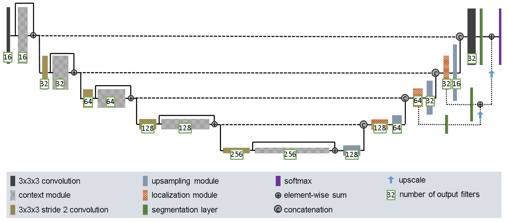
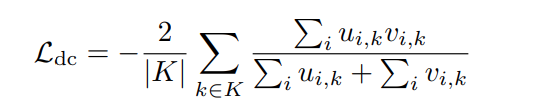
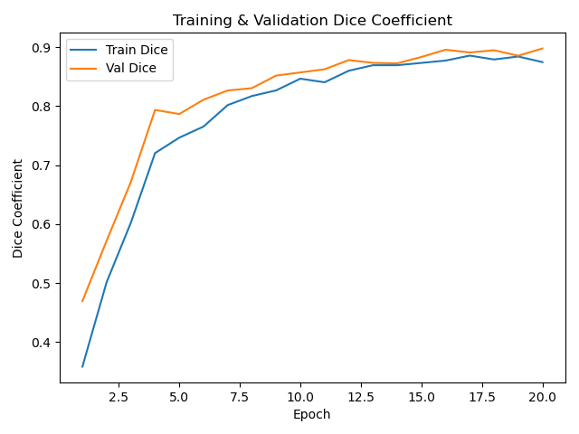
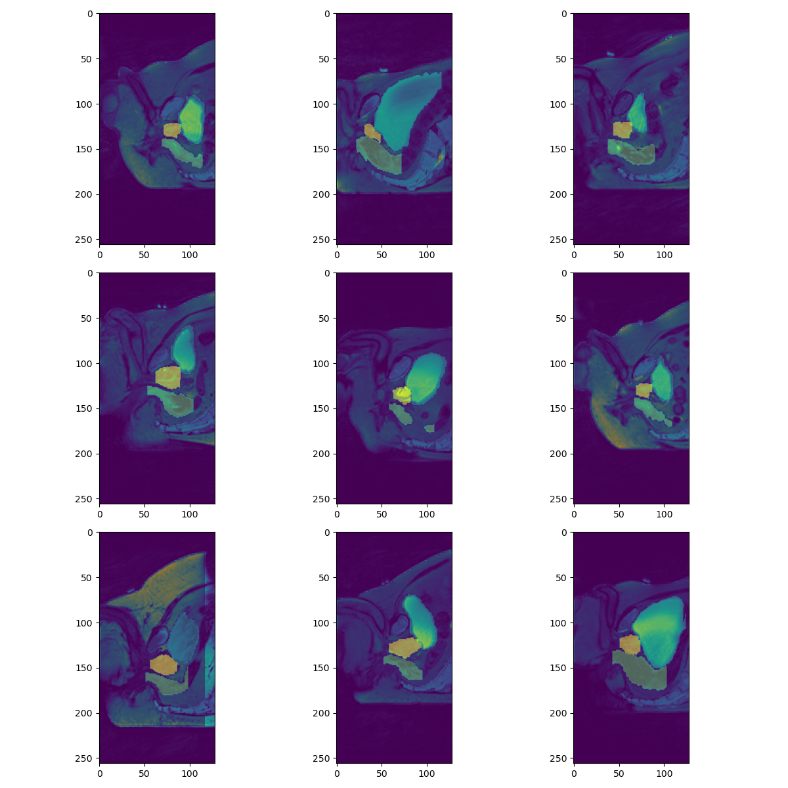
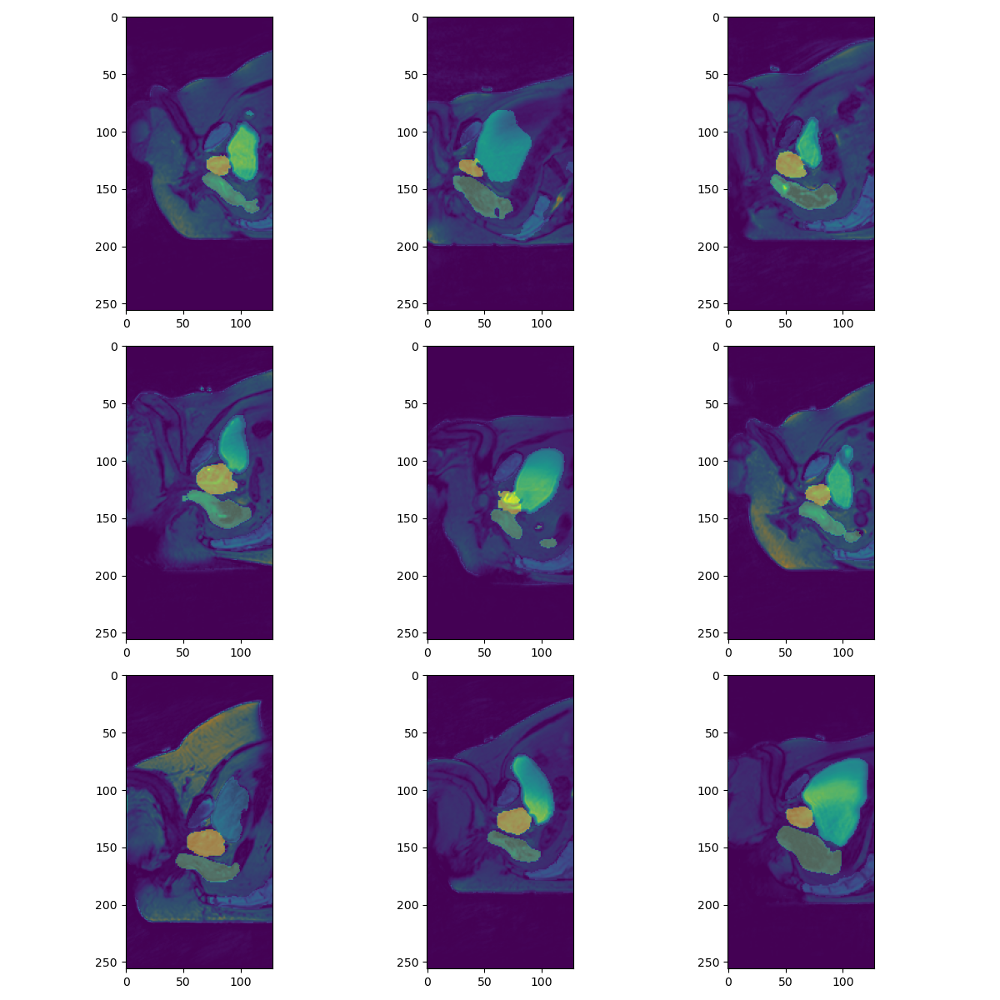

# Prostate 3D Segmentation using a 3D U-Net

## Problem
The task for this project is to perform 3D segmentation on downsampled MRI volumes from the HipMRI Study on Prostate Cancer. The objective is to determine boundaries of prostate and other surrounding structures from the volumetric medical images by training an improved 3D U-Net. The model aims to achieve a Dice Similiarity Coeffecient of >= 0.7 on the test set. Accurate prostate segmentation is important for radiotherapy planning and disease monitoring, and manual annotation is time consuming and subject to variability to a machine model that can perform this task is valuable. [4]

## Model

*Figure 1 – Improved 3D U-Net Architecture*

The UNet used in this project utilises a encoder-decoder architecture designed for volumetric medical image segmentation. It is an enhancement on the standard 3D U-Net by introducing context modules, localization modules and deep supervision, allowing the model to capture both global spatial context and fine structural detail. [1]

* The Encoder progressively reduces spatial resolution, while also increasing feature depth to extract context. Each stage of the encoder uses a ContextBlock which contains a twp 3x3x3 convolutions, instance normalization and Leaky ReLU activation. Between convolutions are a p=0.3 dropout layer to improve generalisation. Skip connections within each block are used for better gradients and Downsampling between stages is done utilising stride-2 convolution.

* At the lowest point a bottleneck ContextBlock identifies high level representations of the image, allowing for the decoder to reconstruct detailed segmentation boundaries.

* The decoder progressively restors spatial resolution while refining segmentation boundries. It does this by Upsampling using transposed 3D convolutions, doubling spatial size each time. The decoder also uses Feature concatenation with encoder outputs used to recover information lost during downsampling. The decoder also utilises a Localisation Module which consists of 1x1x1 and 3x3x3 convolutions which reduce feature map dimensionality and recombines the encoder and decoder features.

* To enhance the gradient flow and improve learning, the model uses segmentation layers at multiple levels of the network which are then combined through elementwise calculation to get the network result. This was done using auxillary segmentation heads attached to decoder layers, which are then upsampled to the final prediction size and element wise summed into the segmentation output. [2]

## Training
The trainig process follows a train to validation to testing structure.
Firstly for data preparation the MRI scans are segmentation masks are converted to PyTorch tensors, we then divide teh dataset into 60% training, 20% validation and 20% testing where each subset has a DataLoader.

Train Test Val Split

Validation 20% Split
* This offers enough data to evaluate model performance per epoch while not taking too much away from training.

Testing 20% split
* This ensures a large enough set of unseen data is left for accurate and meaningful final evaluation.

Training 60% split
* This provides majority of data to allow the model to learn the complex features.

If the dataset had been larger the validation and test proportions could have been smaller, but with a limnited dataset it was important that all three subsets remain representative, as even class distribution across all sets is extremely important for segmentation tasks were certain class can dominate like the background class.

### Augmentation
To improve generalisation and get a better dice score random 3D augmentations were applied 25% of the time, Augmentations were defined in pyimaug3d and included
* GridWarp, a spatial distortion
* Flip(0), horizontal mirroring
* Identity, no operation

### Optimisation
Trainig was driven using Dice loss, inspired by 

*Figure 2 – Dice Loss Function*

This Dice loss measures how much the prediction overlap with the true segmentation. It compares how many voxels are correctly predicted as beloniging to a class versus how many are predicted in total. To compute this the model's probability are compared to a one hot encoded version of the ground truth labels. This allows Dice score to be calculated per class and the averaged allowing for every class to contribute equally to the loss. This is then minimised using 1 - Dice so the model learn to maximise the overlap. 

The network and parameters were updated using the Adam Optimizer of 1e-3.

### Training Loop

For each epoch 
1. The model is placed in trainnig mode and iterates over the training loader
2. Chance for augmentation to be triggered 25% of the time were the sample is modified
3. Dice loss and dice coeffecient are computed and acuumulated
4. The model is switched to evaluation mode and the same metrics are computed on validation set which are used as a performance indicator

After testing we train and evaluate on the held out test set, the mean Dice coeffecient across test is compuited to measure segmentation accuracy and serves as the indicator of model performance.

## Results

The model showed convergence across 20 epochs. As seen in Figure 2 both training and validation Dice coefficients improved steadily during training reaching approximately 0.9 by the final epoch. The validation crve remains slightly above training indicating good generealisation and not too much overfitting.

*Figure 3 – Dice Coeffecient over 20 Epochs*

Across most test cases the model accuretly captures the prostate boundaries and structures with strong similiarities to the ground truth segmentation. Minor deviations do appear often near class boundaries where the model would be unable to clearly distinguish the small borders. This is expected due to the datasets relatively small size. The model did produce smooth consistent relatively accurate segmentations demonstraing the improved 3D U-Net architecture effectively learns to distinguish tissue structure in volumetric MR images.

*Figure 4 - Ground Truth segmentations overlaid on MRI*

*Figure 5 – Predicted segmentations produced by the model*

# Example Usage
python predict.py

# Dependencies
These are the dependencies that were used in creating the program
* Python 3.8.2
* PyTorch 2.2.2
* numpy 1.18.5
* tqdm 4.67.1
* nibabel 4.0.2
* pyimgaug3d 0.43
* matplotlib 3.4.3

# References
IEEE Style

[1] F. Isensee, P. Kickingereder, W. Wick, M. Bendszus, and K. Maier-Hein, “Brain Tumor Segmentation and Radiomics Survival Prediction: Contribution to the BRATS 2017 Challenge,” 2018. Available: https://arxiv.org/pdf/1802.10508v1

[2] R. Li et al., “A COMPREHENSIVE REVIEW ON DEEP SUPERVISION: THEORIES AND APPLICATIONS,” Jul. 2022. Available: https://arxiv.org/pdf/2207.02376

[3] Z. Zhou, R. Siddiquee, N. Tajbakhsh, and J. Liang, “UNet++: A Nested U-Net Architecture for Medical Image Segmentation,” Jul. 2018. Available: https://arxiv.org/pdf/1807.10165

[4] G. Litjens et al., “A Survey on Deep Learning in Medical Image Analysis,” Medical Image Analysis, vol. 42, no. 1, pp. 60–88, Dec. 2017, doi: https://doi.org/10.1016/j.media.2017.07.005.